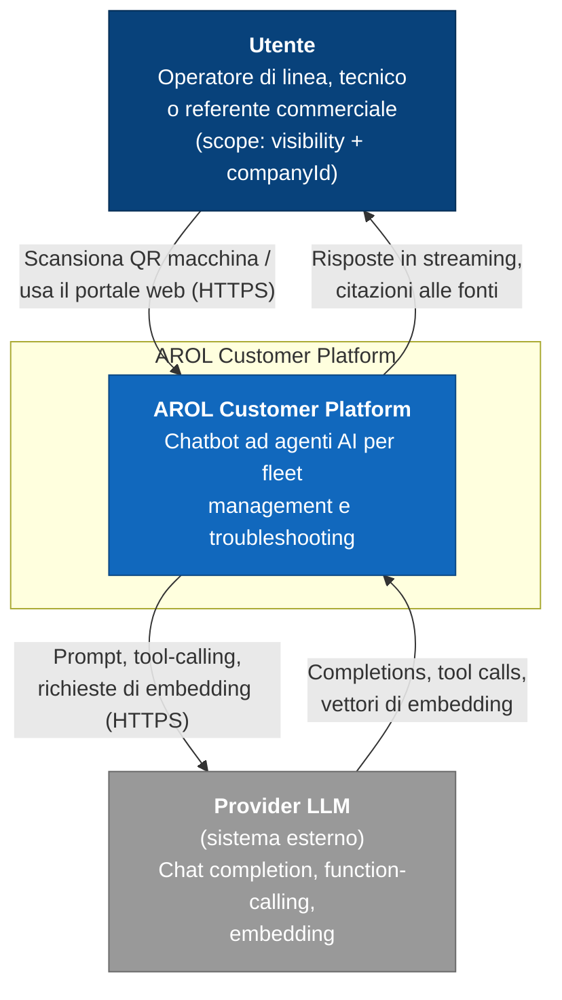

# C4 — Livello 1: System Context

## Scopo

Mostra il sistema **AROL Customer Platform** come una scatola nera, chi lo usa e con quali sistemi esterni scambia dati. Nessun dettaglio interno: quello è oggetto di [`02-containers.md`](02-containers.md).

## Attori e sistemi esterni

- **Utente** — personale delle aziende clienti, con un profilo `visibility` (`full` / `technician` / `commercial`, vedi [`05-data-model.md`](05-data-model.md)) che determina quali domini di dati può interrogare. Accede scansionando il QR applicato alla macchina (entra già scoped su quella macchina) oppure navigando il portale web.
- **Provider LLM** — API cloud esterna usata dal Backend per generazione delle risposte e function-calling degli agenti. In questo progetto è **Mercury** (Inception Labs), raggiunto tramite un'integrazione generica compatibile OpenAI (vedi [`../decisions/0008-provider-llm-generico-mercury.md`](../decisions/0008-provider-llm-generico-mercury.md)) — non le più comuni OpenAI/Azure OpenAI/Anthropic. È l'**unico sistema esterno reale** di questo progetto. L'embedding per il RAG sui manuali (vedi [`03-components.md`](03-components.md)) potrebbe richiedere un endpoint separato, se Mercury non ne espone uno proprio: da verificare in fase di implementazione.

**Nota di scope rispetto alle slide AROL originali:** le slide 4 e 8 della presentazione mostrano ERP, CRM e IoT Platform come sistemi esterni distinti a cui la piattaforma si collega. In questo progetto universitario questi sistemi **non esistono**: sono simulati dal dataset sintetico fornito (`AROL_Q2_synthetic_fleet_dataset.xlsx` + `manuals/`), caricato una tantum nel database interno alla piattaforma (vedi [`02-containers.md`](02-containers.md)). Non sono quindi rappresentati come sistemi esterni in questo diagramma di contesto: il loro contenuto è già "dentro" il sistema.

## Diagramma

