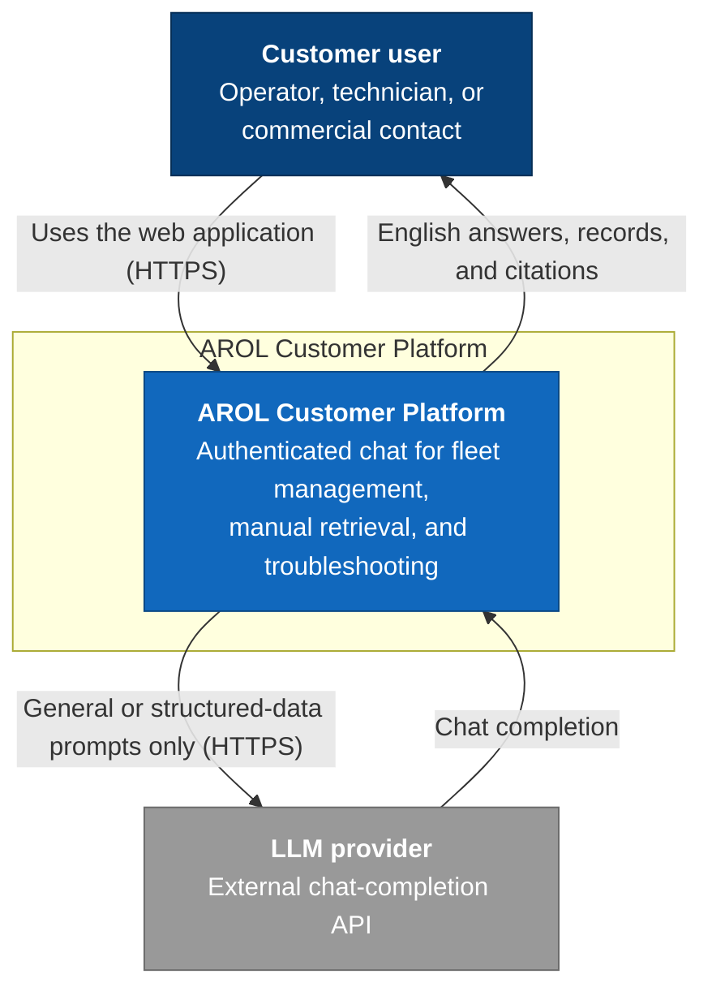

# C4 — Level 1: System Context

## Purpose

The **AROL Customer Platform** helps customer-company users ask questions about
their fleet, technical manuals, alarms, maintenance records, quotes, and
orders. It keeps the supplied synthetic dataset and restricted manuals within
the local environment.

## Actors and external systems

- **Customer user** — an operator, technician, or commercial contact. Their
  company and visibility profile determine what information they can access.
- **LLM provider** — an external OpenAI-compatible chat-completion API used for
  general and structured-data answers. The backend is the only component that
  calls it.

The Excel workbook and the manuals are local project data, not external
systems. Manual text is embedded and retrieved locally, and never passed to the
LLM provider.

## Diagram

