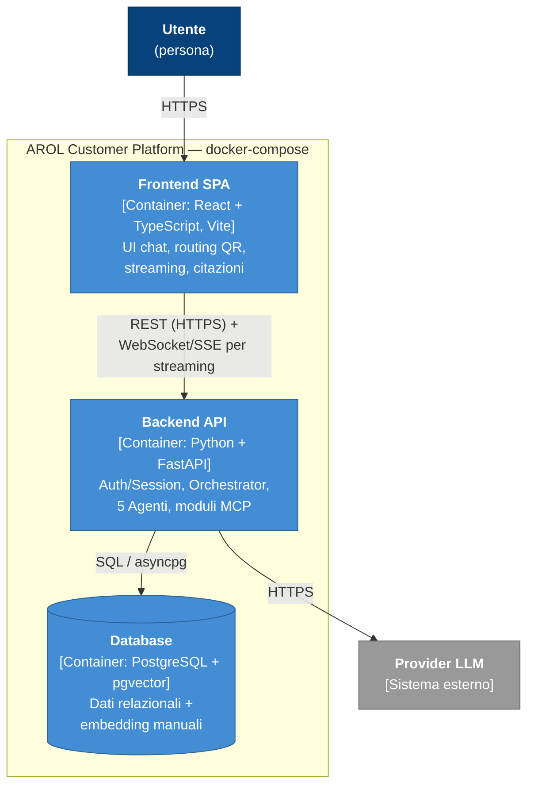

# C4 — Livello 2: Container

## Scopo

Scompone "AROL Customer Platform" nei processi deployabili che lo compongono, con protocolli di comunicazione e mapping diretto sui servizi di [`../../docker-compose.yml`](../../docker-compose.yml).

## Container

| Container | Tecnologia | Responsabilità | Servizio Docker |
|---|---|---|---|
| **Frontend SPA** | React + TypeScript, Vite | UI conversazionale mobile-first, routing `/machines/:id` da QR, rendering streaming + citazioni | `frontend` (porta 5173) |
| **Backend API** | Python, FastAPI | Auth/Session, Orchestrator, i 5 agenti AI, moduli MCP, accesso ai dati — vedi [`03-components.md`](03-components.md) | `backend` (porta 8000) |
| **Database** | PostgreSQL + estensione `pgvector` | Dati relazionali del dataset (Companies, Machines, Quotes, Telemetry, ...) **e** embedding dei chunk dei manuali nella stessa istanza | `db` (porta 5432) |

Il **Provider LLM** (vedi [`01-context.md`](01-context.md)) resta l'unico sistema esterno, raggiunto solo dal Backend.

## Strumento di sviluppo aggiuntivo: Adminer

`docker-compose.yml` include anche un quarto servizio, **Adminer** (`http://localhost:8080`), per ispezionare le tabelle del database da browser durante lo sviluppo. Non fa parte dell'architettura logica del sistema (non è nel diagramma sotto, non ha un ruolo a runtime per l'utente finale): è puro tooling di debug, alla pari di un client SQL grafico installato sul computer.

## Perché 3 container "logici" e non uno per ogni MCP server

Le slide AROL disegnano server MCP distinti (Docs, Files, IoT, ERP, CRM, Search) dietro un MCP Gateway. In questo progetto universitario sono implementati come **moduli Python interni al container Backend**, non come processi/container separati: la motivazione completa è in [`../decisions/0007-topologia-docker-semplificata.md`](../decisions/0007-topologia-docker-semplificata.md). La distinzione logica (namespace dei tool, confini di accesso) resta comunque visibile a livello di componente — vedi [`03-components.md`](03-components.md).

## Diagramma

