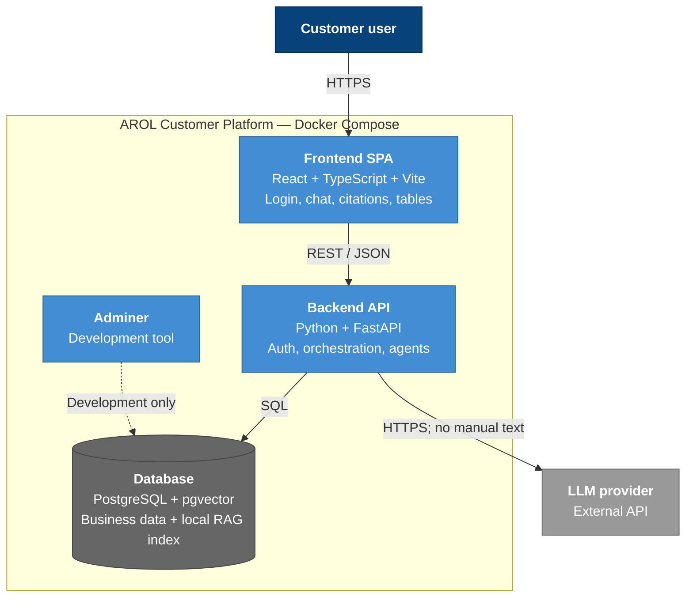

# C4 — Level 2: Containers

## Purpose

The platform is deployed locally through Docker Compose. Its runtime consists
of a frontend, a backend API, and a PostgreSQL database; Adminer is included as
a development-only database browser.

## Containers

| Container | Technology | Responsibility | Docker service |
| --- | --- | --- | --- |
| **Frontend SPA** | React, TypeScript, Vite | Login, chat interface, structured result tables, and manual-source cards. | `frontend` (port 5173) |
| **Backend API** | Python, FastAPI | Authentication, routing, agents, access checks, data retrieval, and response formatting. | `backend` (port 8000) |
| **Database** | PostgreSQL with `pgvector` | Relational dataset, password hashes, and local manual chunks with embeddings. | `db` (port 5432) |
| **Adminer** | Adminer | Development-only browser interface for PostgreSQL. | `adminer` (port 8080) |

The backend is the only service that reaches the external LLM API. Local
embedding generation uses the cached sentence-transformer model and does not
transmit manual content externally.

## Diagram

