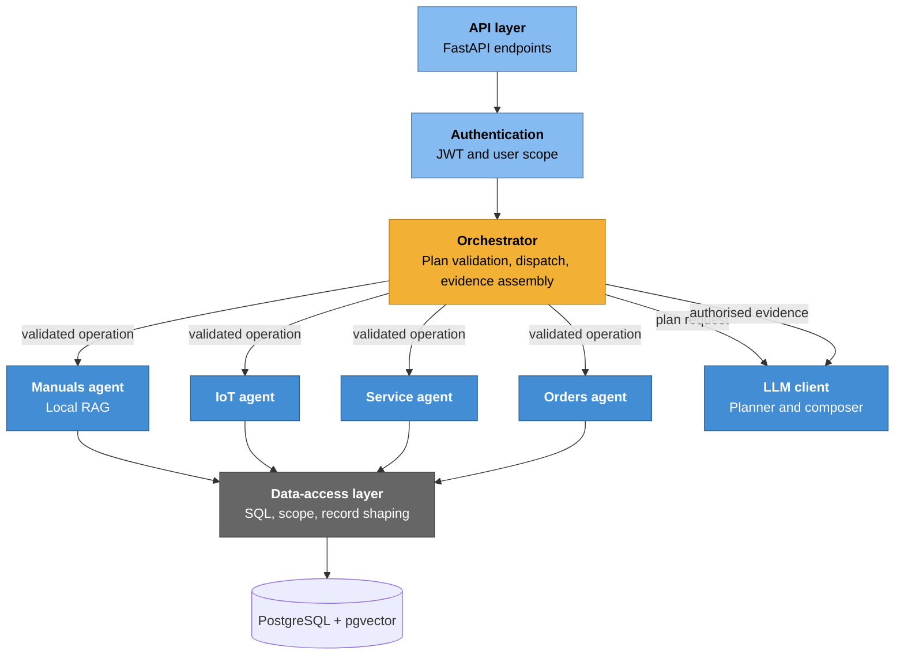

# C4 — Level 3: Backend Components

## Purpose

The backend accepts authenticated requests, determines the relevant domain,
enforces data boundaries, and returns an English answer together with
structured evidence when appropriate.

## Components

| Component | Responsibility |
| --- | --- |
| **API layer** | FastAPI endpoints, input validation, response contracts, and protected-route dependencies. |
| **Authentication** | Verifies login credentials and JWTs; resolves the authenticated user's company and visibility. |
| **Orchestrator** | Uses the LLM to propose a structured plan, validates it against the operation registry, dispatches one or more evidence agents, and asks the LLM to compose a grounded answer. |
| **Manuals agent** | Retrieves and re-ranks chunks from the authorised machine's local PDF index, then builds concise excerpts and citations. |
| **IoT agent** | Retrieves authorised telemetry snapshots and alarm records. |
| **Service agent** | Retrieves authorised maintenance-ticket records. |
| **Orders agent** | Retrieves authorised quote and order records. |
| **Data-access layer** | Encapsulates SQL queries, joins, tenant filters, visibility checks, and record shaping. |
| **LLM client** | Calls the configured external model for structured planning and evidence-grounded response composition. It has no direct database, PDF, or tool access. |

## Cross-cutting contracts

1. **Access control is server-side.** The authenticated company and visibility
   are applied in the API and data-access layer; they are never selected by the
   model or accepted as trusted client input.
2. **Plans are constrained.** The planner can request only allow-listed agent
   operations and typed parameters. It cannot generate SQL, select a tenant,
   or bypass a machine or role check.
3. **Manual retrieval is local.** The PDF corpus, embeddings, vector index,
   and raw chunks stay inside the backend. The composer receives only the
   minimum authorised excerpts needed for the response, with citations.
4. **Evidence is structured.** Manual sources contain a title, excerpt,
   highlights, relevance score, and file/page citation. Operational and
   commercial results are returned as structured records for the frontend.
5. **The composer is evidence-bound.** It must use only the supplied facts,
   cite available sources, and distinguish observed facts from hypotheses.
   It never determines access rights or constructs frontend tables.
6. **English is the response language.** The planner and composer prompts keep
   the chat interface in English.
7. **Empty and denied results differ.** The API reports denied access
   explicitly; the UI distinguishes it from a legitimate empty result.

## Orchestration contracts

The planner, dispatcher, agents, and composer communicate through backend-owned
Pydantic contracts. They are a protocol boundary, not LLM output that can be
trusted without validation.

| Contract | Purpose |
| --- | --- |
| `AgentRequest` | One requested agent, registered operation, and operation parameters. |
| `OrchestrationPlan` | A bounded list of up to four requests plus the machine-context requirement. |
| `AgentResult` | Authorised evidence, citations, warnings, and frontend structured data from one operation. |
| `EvidenceSource` | A stable manual, operational, service, or commercial reference accompanying an evidence result. |

`structured_data` remains separate from composer evidence. The backend returns
it to the frontend for tables; the composer does not invent or control the UI
schema.

The operation registry is the next enforcement layer after plan parsing. Each
registered `(agent, operation)` pair declares an operation-specific Pydantic
parameter model, whether it requires trusted machine context, and the
authorised handler that produces an `AgentResult`. Requests for an unknown
operation, unrecognised parameter, or missing machine context are rejected
before an agent or data-access function is called.

## Diagram

