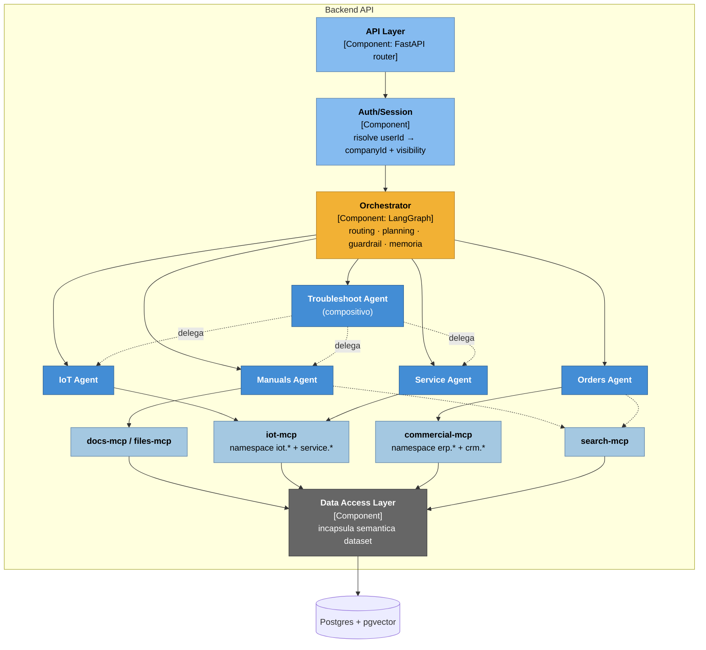

# C4 — Livello 3: Component (container Backend API)

## Scopo

Scompone il container **Backend API** nei suoi componenti logici: come arriva una richiesta, chi decide quale agente coinvolgere, come ogni agente raggiunge i dati, dove viene applicato il controllo degli accessi.

## Componenti

| Componente | Responsabilità |
|---|---|
| **API Layer** | Router FastAPI (REST + WebSocket/SSE), validazione input, avvio dello streaming verso il Frontend |
| **Auth/Session** | Autenticazione utente, risoluzione `userId` → `companyId` + `visibility`, persistenza conversazioni |
| **Orchestrator** | Intent routing, planning, guardrail, memoria di conversazione. Decide quale/i agente/i invocare e compone la risposta finale |
| **Manuals Agent** | RAG sui manuali PDF (namespace tool `docs-mcp` / `files-mcp`) |
| **IoT Agent** | Query su `TelemetrySnapshots`, `Alarms` (namespace tool `iot.*`) |
| **Orders Agent** | Query su `Quotes`, `QuoteRevisions`, `QuoteLines`, `Orders`, `OrderLines` (namespace tool `erp.*` + `crm.*`) |
| **Service Agent** | Query su `MaintenanceTickets` (namespace tool `service.*`) |
| **Troubleshoot Agent** | Agente compositivo: nessuna tabella propria, delega a IoT Agent + Service Agent + Manuals Agent e sintetizza causa/rimedio |
| **Moduli MCP** (`docs-mcp`, `files-mcp`, `iot-mcp`, `commercial-mcp`, `search-mcp`) | Espongono ai singoli agenti solo tool parametrici fissi (mai SQL libero), applicano l'enforcement degli accessi lato server |
| **Data Access Layer** | Query verso Postgres/pgvector, incapsula la semantica del dataset (join, sconti, stato revisioni — vedi [`05-data-model.md`](05-data-model.md)) |

## Discrepanza conteggio agenti (slide 8 = 4, slide 9 = 5)

Slide 8 mostra 4 agenti (Manuals, IoT, Orders & Docs, Troubleshooting). Slide 9 ne mostra 5, aggiungendo **Service Agent · Tickets & support**. `MaintenanceTickets` è un foglio reale del dataset, quindi c'è un dato concreto dietro quell'agente.

**Decisione:** 5 agenti, seguendo slide 9 (la versione più dettagliata); slide 8 è trattata come lo schizzo semplificato dello stesso disegno. Proprietà dei dati, per eliminare ogni ambiguità:

- **IoT Agent** → `TelemetrySnapshots`, `Alarms` (lettura/query, anomaly detection)
- **Service Agent** → `MaintenanceTickets` (cronologia interventi, stato ticket)
- **Troubleshoot Agent** → nessuna tabella propria. Riceve un problema (es. *"perché la macchina X allarma ripetutamente"*), delega a IoT Agent (allarmi recenti) + Service Agent (storico manutenzione correlato) + Manuals Agent (sezione troubleshooting del manuale per il mnemonic dell'allarme), poi sintetizza causa+rimedio. Pattern "agent-as-tool"/sub-agente, non un quinto accesso diretto al DB.
- **Orders Agent** → dominio commerciale completo
- **Manuals Agent** → PDF manuali via RAG

## Contratti trasversali (vincoli di design, non task)

Questi vincoli vanno rispettati da chi implementa i componenti sopra: sono citati qui perché non sono dettagli rimandabili — cambiano la firma dei tool e la forma dei dati fin dal primo componente scritto.

1. **Forma delle citazioni.** Ogni tool restituisce evidenza strutturata, mai prosa libera: `{source: "manual", file, page, section}` oppure `{source: "table", table, rowIds}`. Il Frontend deve poter renderizzare una citazione cliccabile per ogni affermazione basata sui dati.
2. **Lo scope di accesso non attraversa mai il confine del modello.** `companyId` e `visibility` **non compaiono nello schema dei tool esposto al modello**: vengono iniettati lato server (Auth/Session → Orchestrator → moduli MCP) a partire dalla sessione autenticata. Enforcement a doppio strato: nel modulo MCP *e* nella query SQL del Data Access Layer. Un accesso fuori scope restituisce un `ACCESS_DENIED` tipizzato, mai un risultato vuoto silenzioso (vietato esplicitamente da `istruzioni.md`).
3. **La semantica del dataset vive nel Data Access Layer, non nei prompt.** Regole come il join `QuoteLines`→`QuoteRevisions` o il prezzo già netto da sconto devono essere codificate nelle query, altrimenti verranno prima o poi violate da un prompt mal interpretato — dettaglio completo in [`05-data-model.md`](05-data-model.md).
4. **Orologio di business congelato.** Tutti i componenti che ragionano su scadenze/ritardi usano una costante `BUSINESS_TODAY = 2026-08-05` (vedi [`../decisions/0006-orologio-di-business-congelato.md`](../decisions/0006-orologio-di-business-congelato.md)), mai la data reale di sistema.
5. **Il QR è una superficie di controllo accessi.** L'Auth/Session deve verificare che la macchina scansionata appartenga alla `companyId` dell'utente autenticato **prima** di scopare la conversazione su quella macchina — altrimenti un QR è un modo per bypassare il tenant boundary.

## Diagramma

