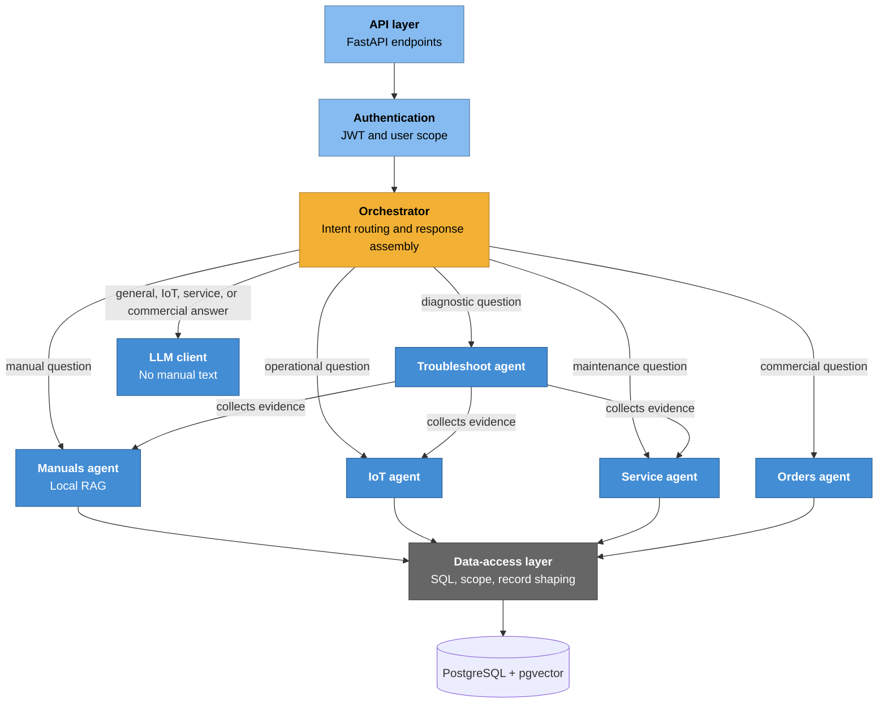

# C4 — Level 3: Backend Components

## Purpose

The backend accepts authenticated requests, determines the relevant domain,
enforces data boundaries, and returns an English answer together with
structured evidence when appropriate.

## Components

| Component | Responsibility |
| --- | --- |
| **API layer** | FastAPI endpoints, input validation, response contracts, and protected-route dependencies. |
| **Authentication** | Verifies login credentials and JWTs; resolves the authenticated user's company and visibility. |
| **Orchestrator** | Routes a question to manuals, IoT, maintenance, orders, troubleshooting, or general handling. |
| **Manuals agent** | Retrieves and re-ranks chunks from the authorised machine's local PDF index, then builds concise excerpts and citations. |
| **IoT agent** | Retrieves authorised telemetry snapshots and alarm records. |
| **Service agent** | Retrieves authorised maintenance-ticket records. |
| **Orders agent** | Retrieves authorised quote and order records. |
| **Troubleshoot agent** | Combines local manual evidence with authorised operational and maintenance evidence. |
| **Data-access layer** | Encapsulates SQL queries, joins, tenant filters, visibility checks, and record shaping. |
| **LLM client** | Calls the configured external model only for flows that do not carry manual text. |

## Cross-cutting contracts

1. **Access control is server-side.** The authenticated company and visibility
   are applied in the API and data-access layer; they are never selected by the
   model or accepted as trusted client input.
2. **Manual retrieval is local.** Manual and troubleshooting flows use local
   retrieval and do not call the external LLM with manual chunks.
3. **Evidence is structured.** Manual sources contain a title, excerpt,
   highlights, relevance score, and file/page citation. Operational and
   commercial results are returned as structured records for the frontend.
4. **English is the response language.** The LLM prompt and local response
   templates are written to keep the chat interface in English.
5. **Empty and denied results differ.** The API reports denied access
   explicitly; the UI distinguishes it from a legitimate empty result.

## Diagram

