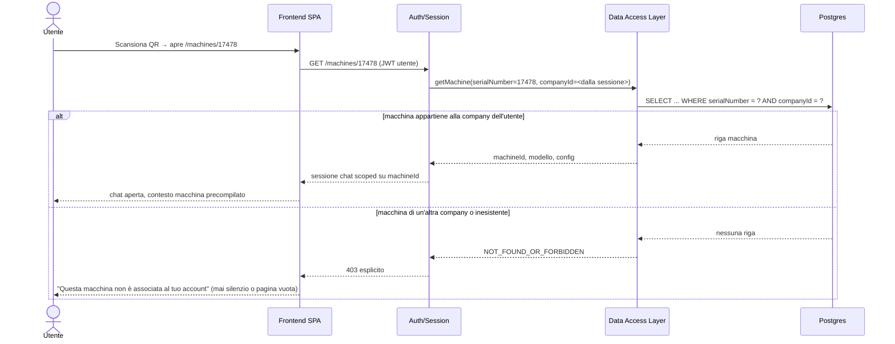
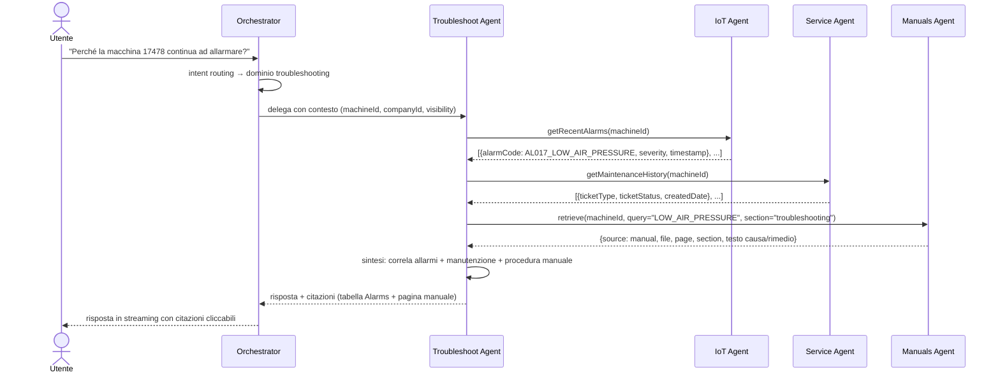
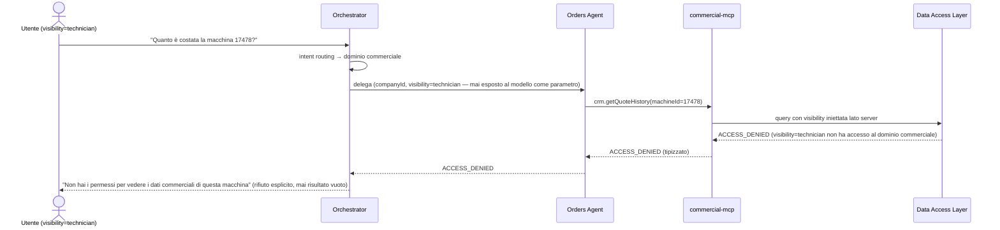

# Diagrammi dinamici — flussi chiave

Diagrammi di sequenza per i tre scenari che più caratterizzano questa architettura: ingresso da QR, ragionamento multi-agente, e rifiuto esplicito per accesso fuori scope. Fanno riferimento ai componenti definiti in [`03-components.md`](03-components.md).

## 1. Ingresso da QR

La scansione del QR è una superficie di controllo accessi (contratto trasversale #5 in [`03-components.md`](03-components.md)): una macchina di un'altra azienda deve produrre un rifiuto esplicito, non uno scoping-e-risposta silenzioso.

## 2. Domanda cross-dominio (troubleshooting)

Esempio: *"Perché la macchina 17478 continua ad allarmare?"* — richiede di comporre 3 agenti, non uno solo.

## 3. Richiesta fuori scope (accesso negato)

Esempio: utente con `visibility = technician` chiede dati commerciali. Il divieto è deciso nel Data Access Layer, non nel prompt (contratto trasversale #2).

