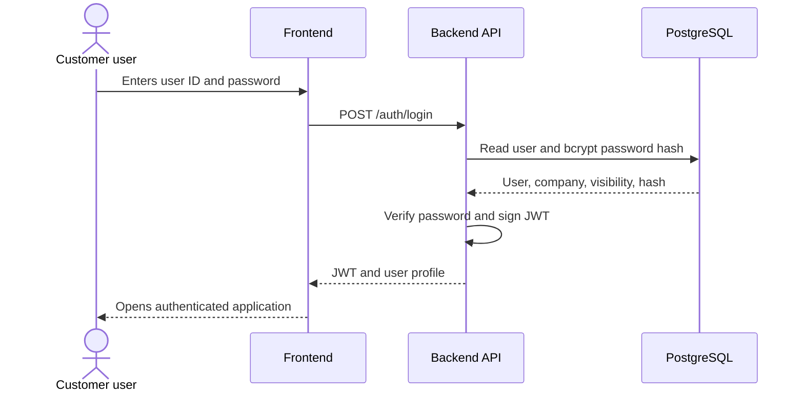
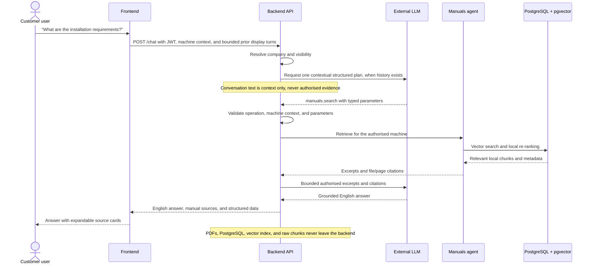
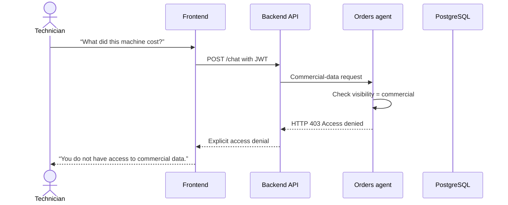

# Dynamic Flows

These sequence diagrams describe three representative flows: authentication,
context-aware local manual retrieval with grounded composition, and a request
rejected by role policy.

## 1. Login

## 2. Manual question

## 3. Request outside the user's role

## Temporary conversational context

While the chat drawer remains open, the frontend sends at most the eight most
recent completed display turns with the next message. When the planner is
enabled, the backend gives those text-only turns to a contextual planner only
when the new message depends on an earlier subject or time, such as "that
alarm" or "yesterday". A self-contained question, including one with an
explicit code or a new subject, is planned independently of earlier turns. A
contextual plan must either ask for clarification or declare and preserve every
identifier that it actually inherits in its parameters. The backend rejects a
plan that introduces, drops, or loosens an inherited reference, then retrieves
fresh authorised evidence through the operation registry. The context is never
persisted or treated as evidence. Manual excerpts, sources, structured data,
and private manual chunks are excluded from the conversational context payload.
