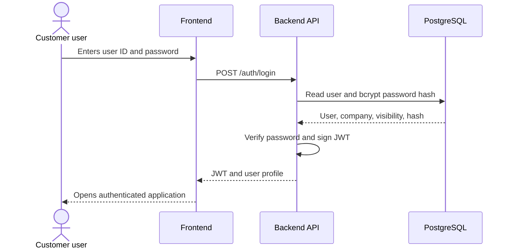
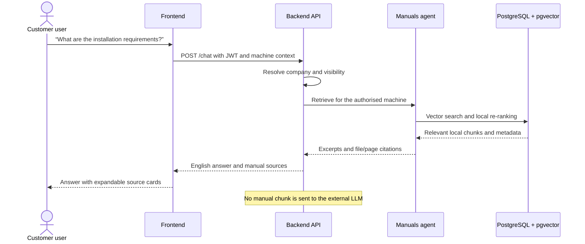
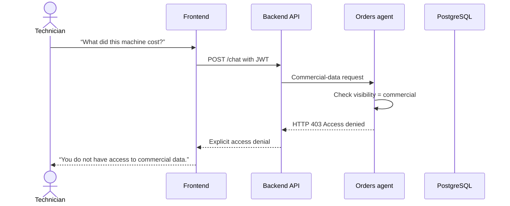

# Dynamic Flows

These sequence diagrams describe three representative flows: authentication,
local manual retrieval, and a request rejected by role policy.

## 1. Login

## 2. Manual question

## 3. Request outside the user's role

