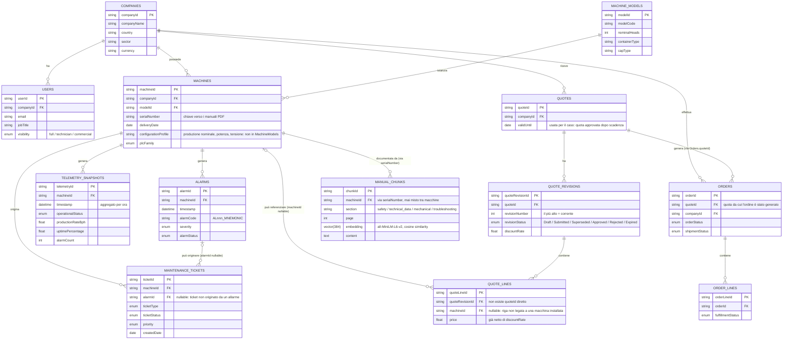

# Modello dati

Schema verificato contro i nomi reali di fogli e colonne di `data/AROL_Q2_synthetic_fleet_dataset.xlsx` (12 fogli, coerenti con [`../../istruzioni.md`](../../istruzioni.md)), più `manual_chunks`, tabella aggiuntiva per il RAG sui manuali (non fa parte del dataset originale).

## Diagramma entità-relazione

## Semantica che deve vivere nelle query, non nei prompt

Regole esplicite in `istruzioni.md` che un prompt può dimenticare o violare sotto pressione conversazionale — vanno incapsulate nel Data Access Layer ([`03-components.md`](03-components.md)):

- `QuoteLines` si raggiunge da `Quotes` solo passando per `QuoteRevisions` (non esiste `quoteId` diretto sulle righe).
- `QuoteLines.price` è già netto dello sconto di revisione: non riapplicare `discountRate`.
- `OrderLines` non contiene articolo/quantità/prezzo propri: il contenuto di un ordine si ottiene dalle quote lines della revisione approvata.
- La revisione corrente di una quotazione è quella con `revisionNumber` più alto; le altre sono superseded.
- `TelemetrySnapshots.productionRateBph`/`uptimePercentage` sono `0` quando la macchina non produce — non sono indicatori di guasto di per sé.
- La normalità di una lettura di telemetria va giudicata rispetto a `Machines.configurationProfile` (specifico della macchina fisica), non rispetto a `MachineModels` (specifico del modello): due macchine dello stesso modello non sono intercambiabili.

## Inventario edge case noti dal dataset

`istruzioni.md` dichiara esplicitamente che individuare gli edge case è parte della valutazione del progetto. Inventario di partenza (da confermare/estendere quando il dataset reale sarà disponibile):

- FK nulle che un inner join farebbe sparire silenziosamente: `QuoteLines.machineId`, `MaintenanceTickets.alarmId`, `MachineModels.primitiveDiameter`.
- Una company con utenti ma senza macchine.
- Una quotazione approvata dopo la propria scadenza.
- Una quotazione la cui revisione finale è stata rifiutata.
- Macchine le cui ore di servizio accumulate hanno superato una soglia di manutenzione definita nel loro manuale.

Ognuno di questi casi è candidato naturale per il set di valutazione del chatbot (risposta corretta **e** rifiuto/assenza-dato dichiarati esplicitamente, mai un vuoto silenzioso).
