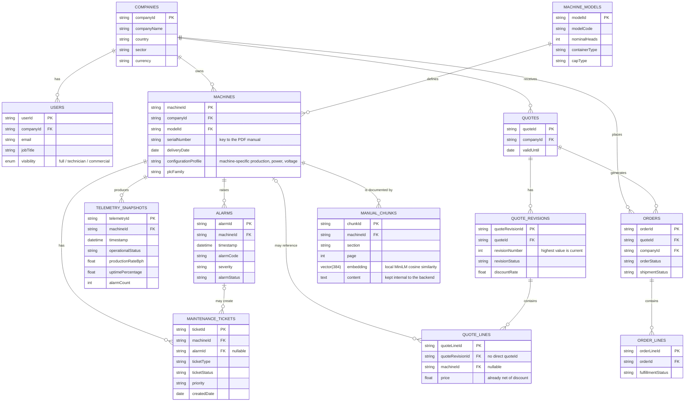

# Data Model

The schema is based on the supplied Excel workbook and is extended with
`manual_chunks`, the local RAG table. The workbook and manuals remain in the
Git-ignored `data/` directory.

## Entity-relationship diagram

## Query semantics

The following rules belong in the data-access layer, not in LLM prompts:

- A quote line is reached from a quote through `QuoteRevisions`; it has no direct `quoteId`.
- `QuoteLines.price` is already net of the revision discount and must not be discounted again.
- An order's content is obtained from the lines of its approved quote revision.
- The current quote revision is the one with the highest `revisionNumber`.
- Quote expiry is evaluated against the fixed business date `2026-08-05`;
  a quote is expired only when `validUntil` is earlier than that date.
- A zero production rate or uptime value can mean that a machine is not producing; it is not automatically a fault.
- Telemetry production is interpreted against the physical machine's `configurationProfile`, not only against the shared machine model. When the machine is `Running`, the API compares the rate with the nominal `bph` extracted from that profile using a ±10% reference band. A zero rate outside `Running` is reported as not assessed, not as a fault.

## Important edge cases

- Nullable foreign keys: `QuoteLines.machineId`, `MaintenanceTickets.alarmId`, and `MachineModels.primitiveDiameter`.
- A company can have users without any machines.
- A quote can be approved after its validity date, or end with a rejected revision.
- Machines of the same model may have different configuration profiles.
- Maintenance thresholds can be documented only in the machine-specific manual.
